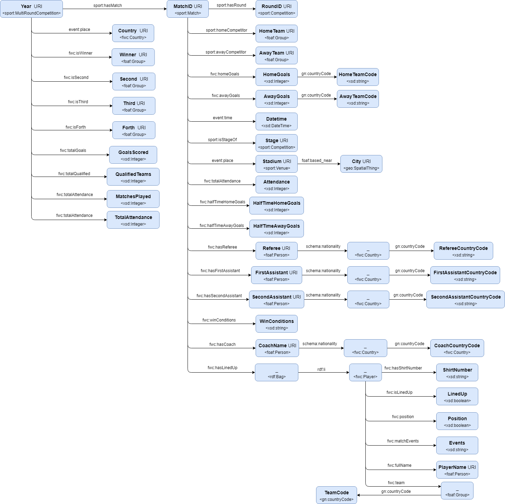

# Transformación y explotación de datos históricos de la FIFA Word Cup

#### Javier Guzmán Figueira Domínguez - javier.figueira@posgrado.uimp.es

#### Web semántica y datos enlazados

##### Versión 0.0.1 (25-06-2018)

 
This work is licensed under a <a rel="license" href="http://creativecommons.org/licenses/by/4.0/">Creative Commons Attribution 4.0 International License</a>.

## Tabla de contenidos

1. [Introducción](#intro)

2. [Proceso de transformación](#transform)

    2.1. [Selección de la fuente de datos](#select)

    2.2. [Análisis de los datos](#analysis)
    
    2.3. [Estrategia de nombrado](#strategy)
    
    2.4. [Desarrollo de vocabulario](#vocabulary)
    
    2.5. [Proceso de transformación](#transformation)
    
    2.6. [Enlazado](#link)
    
    2.7. [Publicación](#publish)

3. [Aplicación y explotación](#application)

4. [Conclusiones](#conclusions)

5. [Bibliografía](#references)
---

## <a name="intro"/>1. Introducción</a>

&nbsp;&nbsp;&nbsp;&nbsp;El objetivo final de la Web de datos es permitir que las computadoras realicen un trabajo más útil y desarrollar sistemas que puedan admitir interacciones confiables a través de la red. El término "Web Semántica" se refiere a la visión del W3C de la Web de datos enlazados. Las tecnologías de la Web semántica permiten crear almacenes de datos en la Web, vocabularios y generar reglas para manejar los datos. De esta forma, no solo se construye una red de datos abierta y global, sino que se enriquecen las relaciones entre los datos de forma semántica.

&nbsp;&nbsp;&nbsp;&nbsp;En este documento, se recoge como se ha realizado un proceso de transformación de un conjunto de datos en formato *CSV*, desde su selección hasta su publicación, pasando por desarrollo del vocabulario y el proceso de transformación. Así mismo, se presentará un propotipo funcional que haga uso de los datos transformados a datos enlazados. Con este prototipo se podrá advertir el pontencial de explotación de los datos transformados.

## <a name="transform"/>2. Proceso de transformación</a>

### <a name="select"/>2.1. Selección de la fuente de datos</a>

[comment]: # (Selección de la fuente de datos, donde se explique el conjunto de datos que se ha seleccionado para transformar, especificando su origen.)
&nbsp;&nbsp;&nbsp;&nbsp;Para la selección del conjunto de datos, se ha realizado una búsqueda en la colección de *datasets* de la plataforma *on-line* [Kaggle](https://www.kaggle.com/). Ésta es una plataforma que tanto alberga competiciones de minería de datos, como contiene soluciones de minería datos, debates en forma de foros y *datasets* públicos. Entre uno de estos conjuntos de datos públicos, se ha seleccionado el denominado por la plataforma como [FIFA World Cup](https://www.kaggle.com/abecklas/fifa-world-cup).

&nbsp;&nbsp;&nbsp;&nbsp;Para la selección del conjunto de datos, se ha realizado una búsqueda en la colección de *datasets* de la plataforma *on-line* [Kaggle](https://www.kaggle.com/). Ésta es una plataforma que tanto alberga competiciones de minería de datos, como contiene soluciones de minería datos, debates en forma de foros y *datasets* públicos. Entre uno de estos conjuntos de datos públicos, se ha seleccionado el denominado por la plataforma como [FIFA World Cup](https://www.kaggle.com/abecklas/fifa-world-cup).

&nbsp;&nbsp;&nbsp;&nbsp;Este conjunto de datos contiene información sobre los resultados, de las fases finales, de las copas del mundo de futbol (entre 1930 y 2014). Estos datos se presentan a través de tres ficheros en formato CSV, conteniendo datos genéricos de cada edición, datos de los jugadores que compitieron en cada una de las mismas y datos de los resultados que se produjeron en cada uno de los partidos disputados.

&nbsp;&nbsp;&nbsp;&nbsp;Haciendo un análisis preliminar del conjunto de datos, se puede observar como éstos contienen referencias a jugadores, fechas y localizaciones (con referencias a ciudades, estadios y países). Por consiguiente, estas potenciales referencias convierten a este conjunto de datos en un candidato idoneo para su transformación a datos enlazados.

&nbsp;&nbsp;&nbsp;&nbsp;Como se indica en la plataforma _Kaggle_, estos datos han sido cedidos por cortería de la página web del [Archivo de la Copa del Mundo de la FIFA](https://www.fifa.com/fifa-tournaments/archive/index.html).

### <a name="analysis"/>2.2. Análisis de los datos</a>

[comment]: # (Análisis de los datos, explicando que tipo de datos se manejan, su formato, tipos de valores, y en general cualquier aspecto relevante para su transformación y explotación. Este análisis debe incluir la licencia de origen de los datos y la justificación de la licencia a usar en los datos transformados.)

&nbsp;&nbsp;&nbsp;&nbsp;Tal y como se ha indicado en la subsección anterior, el conjunto de datos continene tres ficheros en formato CSV. Por consiguiente, el objetivo de esta sección consitirá en analizar el tipo de datos manejados en cada uno de los ficheros y sus características. Así mismo, se analizará la licencia bajo la que se han distribuido estos datos y se in justificará la licencia elegida en los datos aquí transformados.

#### 2.2.1. Ediciones

&nbsp;&nbsp;&nbsp;&nbsp;El archivo _WorldCups.csv_ del conjunto de datos contiene la información referente a cada una de las ediciones celebradas de la copa del mundo. Dado que se han celebrado un total de 20 campeonatos, este el número de instancias que contiene este fichero. Además, no se aprecian valores nulos o perdidos en este conjunto. Para la definición del vocabulario, tienen relevancia las caraterísticas referentes al país de celebración del evento y las referencias a países que ocuparon los primeros lugares en el torneo.

&nbsp;&nbsp;&nbsp;&nbsp;A continuación, se detallan cada una de las caraterísticas de los datos relacionados con las ediciones:
 
 

Propiedad       | Tipo     | Ejemplo       | Descripción                  
----------------|----------|---------------|------------------------------
Year            | Date     | 1930          | Año de disputa del campeonato
Country         | String   | Uruguay       | País anfitrión del campeonato
Winner          | String   | Uruguay       | Nombre del equipo vencendor
Runners-Up      | String   | Argentina     | Nombre del equipo que terminó en segundo lugar
Thrid           | String   | USA           | Nombre del equipo que terminó en tercer lugar
Fourth          | String   | Yugoslavia    | Nombre del equipo que terminó en cuarto lugar
GoalsScored     | Integer  | 70            | Número total de goles anotados en el torneo
QualifiedTeams  | Integer  | 13            | Número total de equipos clasificados para el torneo
MatchesPlayed   | Integer  | 18            | Número total de partidos disputados
Attendance      | Integer  | 590.549       | Número total de asistentes a lo largos del torneo

#### 2.2.2. Partidos

&nbsp;&nbsp;&nbsp;&nbsp;El archivo _WorldCupPlayers.csv_ contiene información relacionada con los partidos que se han jugado en cada una de las ediciones de la copa del mundo. Esta sección del conjunto de datos contiena un total de 4572 instancias. Cada una de estas instancias, se identifican mediante un identificador de ronda ("RoundID") y un identificador de partido ("MatchID"). Aunque estos indicadores son de tipo numérico (sólo contienen cifras), se tratarán con cadenas de texto al tratarse de códigos sin propiedades numéricas. Cabe mencionar, que tienen especial relevancia los datos relacionados con lugares como países, ciudades, estadios y las referencias a los nombre y nacionalidades de los árbitros de cada partido.

&nbsp;&nbsp;&nbsp;&nbsp;A continuación, se detallan cada una de las caraterísticas de los datos relacionados con los partidos jugados:
 
 

Propiedad            | Tipo     | Ejemplo                     | Descripción                  
---------------------|----------|-----------------------------|------------------------------
Year                 | Date     | 1930                        | Año de disputa del partido
Datetime             | Date     | 13 Jul 1930 - 15:00         | La fecha y hora a la que se comenzó a jugar el partido.
Stage                | String   | Group 1                     | Fase o grupo en el que se jugó el partido
Stadium              | String   | Pocitos                     | Nombre del estadio en que celebró el enfrentamiento
City                 | String   | Montevideo                  | Nombre del equipo que terminó en tercer lugar
Home Team Name       | String   | France                      | Nombre del equipo que disputó el partido jugando como local
Home Team Goals      | Integer  | 4                           | Goles anotados por el equipo local
Away Team Goals      | Integer  | 1                           | Goles anotados por el equipo visitante
Away Team Name       | String   | Mexico                      | Nombre del equipo que disputó el partido jugando como visitante
Win conditions       | String   | France win after extra time | Condiciones especiales de la victoria (tiempo extra, penalties...)
Attendance           | Intenger | 4.444                       | Número total de asistentes al partido
Half-time Home Goals | Intenger | 3                           | Goles anotados por el equipo local, al término de la primera parte
Half-time Away Goals | Intenger | 0                           | Goles anotados por el equipo vistante, al término de la primera parte
Referee              | String   | LOMBARDI Domingo (URU)      | Nombre del árbitro principal e iniciales de su nacionalidad 
Assistant 1          | String   | CRISTOPHE Henry (BEL)       | Nombre del primer asistente arbitral e iniciales de su nacionalidad
Assistant 2          | String   | REGO Gilberto (BRA)         | Nombre del segundo asistente arbitral e iniciales de su nacionalidad
RoundID              | String   | 201                         | Identificador de la ronda
MatchID              | String   | 1086                        | Identificador del partido
Home Team Initials   | String   | FRA                         | Iniciales del equipo que disputó el partido jugando como local
Away Team Initials   | String   | MEX                         | Iniciales del equipo que disputó el partido jugando como visitante

#### 2.2.3. Jugadores

&nbsp;&nbsp;&nbsp;&nbsp;El archivo _WorldCupMatches.csv_ contiene información relacionada con los jugadores, de cada una de las plantillas, que han disputado partidos en los campeonatos celebrados. Cada una de las instancias de esta porción del dataset tiene una referencia con el partido y la ronda en la que intervino cada jugador. Esta referencia se crea por medio de los identificadores "RoundID" y "MatchID", comentados en el anterior apartado. Así mismo, aquí tendrán relevancia las referencias a los nombres de los jugadores y sus números de camisetas; así como los nombres de los entrenadores y sus nacionalidades.

&nbsp;&nbsp;&nbsp;&nbsp;A continuación, se detallan cada una de las caraterísticas de los datos relacionados con los jugadores de los equipos participantes en cada una de las ediciones:
 
 

Propiedad       | Tipo     | Ejemplo             | Descripción                  
----------------|----------|---------------------|------------------------------
RoundID         | String   | 201                 | Identificador de la ronda
MatchID         | String   | 1096                | Identificador del partido
Team Initials   | String   | FRA                 | Iniciales del equipo
CoachName       | String   | CAUDRON Raoul (FRA) | Nombre del entrenador e iniciales de su nacionalidad
Line-up         | Boolean  | S                   | Presencia en el equipo titular
Shirt Number    | Integer  | 0                   | Número de camiseta
Player Name     | String   | Andre MASCHINOT     | Nombre del jugador
Position        | String   | C                   | Posición en el campo (únicamente se muestra si el jugador es portero, capitán o ambos)
Event           | Array    | G43' G87'           | Eventos relacionados con el jugador durante el partido (goles, tarjetas, penalties ...)

#### 2.2.3. Licencia

&nbsp;&nbsp;&nbsp;&nbsp;El conjunto de datos se ha distribuido bajo la licencia [CC0](https://creativecommons.org/publicdomain/zero/1.0/) o de *Dedicación a Dominio público*. Esto significa que es un tipo de licencia definida por [Creative Commons](https://creativecommons.org/licenses/), una organización sin ánimo de lucro dedicada a facilitar instrumentos jurídicos gratuitos que faciliten tanto usar como compartir todo tipo de conocimiento. En contreto, en la licencia aplicada aquí permite:
- Uso privado
- Modificación
- Distribución
- Uso comercial, tanto del propio conjunto de datos, como de sus derivados.

&nbsp;&nbsp;&nbsp;&nbsp;Tal y como se puede observar, la distribución por medio de este tipo de licencia se asemeja mucho a la *No licencia* o *Unlicense*. *CC0* permite a todo tipo de creadores y propietarios de contenido protegido por derechos de autor o de bases de datos (como es este caso) renunciar a cualquier interés sobre los mismos y liberalos al dominio público. De esta manera, cualquiera puede utilizar tales materiales para cualquier fin, sin restricciones. A diferencia de [Etiqueta de Dominio Público](https://creativecommons.org/share-your-work/public-domain/pdm/), *CC0* no se debe usar para etiquetar obras ya liberadas de restricciones de derechos de autor y de bases de datos que sea de dominio público en todo el mundo.

&nbsp;&nbsp;&nbsp;&nbsp;La licencia *CC0* del conjunto de datos permite asignar cualquier licencia a los materiales derivados de los mismos. Por lo tanto, no hay restricciones en tal aspecto. Tanto la presente memoria, como los datos enlazados generados y la aplicación aqui presentada, se comparten utilizando la licencia [CC BY](https://creativecommons.org/licenses/by/4.0/). Se ha elegido este tipo de licencia dado que es la modalidad menos restrictiva que obliga al reconocimiento de autoría.Esta licencia permite:
  - La libre distribución de la obra mediante cualquier formato o medio.
  - La modificación o transformación total o parcial del material.
  - La distribución con propósitos comerciales.

Así mismo, tales acciones deben realizarse bajo las siguientes restricciones:
  - Reconocimiento adecuado de la autoría del material.
  - Proporcionar un enlace a la licencia elegida.
  - Indicación de los cambios realizados sobre el material original.

### <a name="strategy"/>2.3. Estrategia de nombrado</a>

[comment]: # (Estrategia de nombrado, donde se explique cómo se van a nombrar los recursos tanto del vocabulario a desarrollar como de los datos a generar.)

&nbsp;&nbsp;&nbsp;&nbsp;En esta sección, se presenta y justifica la estrategia de nombrado de recursos que utilizaremos, tanto en el vocabulario como en los los datos que trataremos.

&nbsp;&nbsp;&nbsp;&nbsp;En primer lugar, se procede a escoger el formato de las URIs que necesitaremos utilizar. Es vital atender a que el conjunto de individuo que tratamos es bastante amplio y está en crecimiento, con adición de elementos en todos los partidos de nuevas ediciones de la copa. Ergo, se utilizará la barra inclinada o *slash* para referenciar a tales individuos. Por su parte, la ontología debe ser fija y de menor tamaño; por ello, se emplearán el *hash* para designar a los términos ontológicos que definamos

&nbsp;&nbsp;&nbsp;&nbsp;Como dominio de todas URIs que definamos, se elige uno disponible y que tenga cierta relación con el contenido del conjunto de datos enlazados que aquí se generará. Por ejemplo: `http://linkeddata.fifawordcup.org`. Utilizando este domino, se definen las rutas base para individuos `http://linkeddata.fifawordcup.org/resources/`  y ontologías `http://linkeddata.fifawordcup.org/ontology/WordCup#`.

&nbsp;&nbsp;&nbsp;&nbsp;Finalmente, se define el patrón para las clases y propiedades de la ontologías, tal que `http://linkeddata.fifawordcup.org/ontology/WordCup#<term_name>`. De forma que `<term_name>` sea el nombre desinado para cada uno de los términos creados. Así mismo, se utilizará el patrón `http://linkeddata.fifawordcup.org/resources/<resource_name>/<resource_id>` para referirnos a individuos de un tipo `<resource_name>` e identificados por `<resource_id>`. 

&nbsp;&nbsp;&nbsp;&nbsp;Nota: todos los nombres utilizados para designar tanto términos como recursos, estarán en formato [*camel case*](https://eslint.org/docs/rules/camelcase). Esto implicará realizar algunos renombrados en la etapa de transformación del conjunto de datos.

### <a name="vocabulary"/>2.4. Desarrollo de vocabulario</a>

[comment]: # (Desarrollo del vocabulario, indicando el proceso de implementación del vocabulario y como este soporta los datos de origen. No se exige una ontología compleja, sino un vocabulario suficiente para describir los conceptos y propiedades de los datos a transformar.)

### <a name="transformation"/>2.5. Proceso de transformación</a>

[comment]: # (Proceso de transformación, justificando qué herramientas se han usado para la transformación de los datos y qué pasos se han seguido para su limpieza y adecuación al resultado esperado.)

&nbsp;&nbsp;&nbsp;&nbsp;Para realizar un tratamiento del conjunto de datos de forma uniforme, se ha de juntar los datos en un único fichero. Para ello, se ha creado un _script_ en R, debido a su sencillez para realizar este tipo de operaciones. En esta operación, se juntan los datos de las ediciones y los partidos, tomando como referenciacomún el año del campeonato _Year_ (único en el conjunto de datos de ediciones). De igual manera, se fusiona esta tabla resultante con los datos de los jugadores, utilizando como referencia común el identificador de partido _MatchID_ (también único en el fichero de partidos). Sin embargo, es necesario eliminar varias columnas vacías e instancias duplicadas en este _dataset_. 

&nbsp;&nbsp;&nbsp;&nbsp;El conjunto de datos resultante se ha guardado en en el archivo nombrado _WordCupData.csv_. Y una vez fusionados todos los archivos, se procede a realizar un análisis y tratamiento global de los datos (para ello se ha utilizado la plataforma [LOFRefine](https://github.com/sparkica/LODRefine)). Ésta consiste en un *fork* de [OpenRefine](https://github.com/OpenRefine/OpenRefine) que incluye integrados las extensiones de *DBpedia*, *RDF*, *crowdsourcing* y *stats*.

&nbsp;&nbsp;&nbsp;&nbsp;En primer lugar, se identifican a que datos son necesarios de cambiar de tipo (dado que todos los datos se tratan inicialmente como cadenas de texto). Como se ha explicado, se ha decidido que los datos que consitan en cifras pero no tengan valor numérico, se considerarán de tipo _string_. Este es el caso de las caraterísticas _MatchID_, _RoundID_ y _ShirtNumber_. Por el contrario, se deben de convertir a numéricas las propiedades _GoalsScored_, _MatchesPlayed_, _TotalAttendance_, _HomeTeamGoals_, _AwayTeamGoals_, _Attendance_, _HalfTimeHomeGoals_ y _HalfTimeAwayGoals_.

&nbsp;&nbsp;&nbsp;&nbsp;También se procede a transformar y/o generar datos de algunas de las características. Uno de estos datos es el de la fecha y hora de cada partido (denominada _Datetime_), que es necesario transformalo para que tome un formato de tipo _DateTime_ adecuado. Así mismo, los datos de entrenadores y conjuntos arbitrales incluyen tanto sus nombres y apellidos (de forma invertida), como las iniciales de su nacionalidad. Por lo tanto, se han generado nuevas características con estas iniciales (para todas las propiedaes originales afectadas) y se han modificado su nombre para invertir su orden.

&nbsp;&nbsp;&nbsp;&nbsp;Se puede apreciar como hay algunas variables con valores vacíos. Por ejemplo, la propiedad _WinConditions_ recoge descripciones de situaciones especiales en victorias (como goles en el tiempo añadido, victorias por penalties) y la propiedad _Position_ que únicamente refleja si un jugador es capitán y/o portero (por lo que es inútil en la mayoría de las instancias). Por su parte, será relevante convertir la propiedad _Line.up_ para que sea de un tipo _boolean_.

### <a name="#link"/>2.6. Enlazado</a>

[comment]: # (Enlazado, donde se explique qué enlaces se han generado con fuentes externas y mediante qué herramientas.)

&nbsp;&nbsp;&nbsp;&nbsp;En esta sección se describe los aspectos relacionados con el enlazodo de datos con fuentes externas, en el proceso de transformación del conjunto de datos. Para ello, se ha empleado como herramienta el [Servicio de reconciliación de OpenRefine](https://github.com/OpenRefine/OpenRefine/wiki/Reconciliation). Se ha registrado el endpoint _SPARQL_ de la [DBpedia](https://wiki.dbpedia.org/) `https://dbpedia.org/sparql` y se han "reconciliado" los datos con los tipos que mayor número de enlaces en instancias han cubierto.

&nbsp;&nbsp;&nbsp;&nbsp;Se han generado enlaces para los recursos del vocabulario definido, que hagan referencia a personas, lugares o momentos. Estas relaciones se representan, en el fichero RDF generado en formato Turtle, por medio de la propierdad _owl:sameAs_. A continuación, se presentan los tipos escogidos para cada uno de los enlaces externos generados:

| Recurso             | Tipo enlazado
|---------------------|---------------
| Country             | `http://www.wikidata.org/entity/Q6256`
| Referee             | `http://www.wikidata.org/entity/Q5`
| Referee             | `http://www.wikidata.org/entity/Q5`
| FirstAssistant      | `http://www.wikidata.org/entity/Q5`
| CoachName           | `http://www.wikidata.org/entity/Q5`
| PlayerName          | `http://www.wikidata.org/entity/Q5`
| HomeTeam            | `https://www.wikidata.org/wiki/Q6256`
| AwayTeam            | `https://www.wikidata.org/wiki/Q6256`
| City                | `http://dbpedia.org/ontology/City`
| Stadium             | `http://dbpedia.org/ontology/Stadium`
| Winner              | `https://www.wikidata.org/wiki/Q6256`
| Second              | `https://www.wikidata.org/wiki/Q6256`
| Third               | `https://www.wikidata.org/wiki/Q6256`
| Forth               | `https://www.wikidata.org/wiki/Q6256`
| Year                | `http://dbpedia.org/page/Year`

## <a name="publish"/>3. Aplicación y explotación</a>

[comment]: # (Aplicación y explotación, explicando qué funcionalidades aporta la solución desarrollada y cómo ésta hace uso de los datos y enlaces generados para aportar valor al usuario final. En este punto de deben explicar las queries SPARQL o el código en Jena usado para su implementación.)

## <a name="conclusions"/>4. Conclusiones</a>

## <a name="references"/>5. Bibliografía</a>
